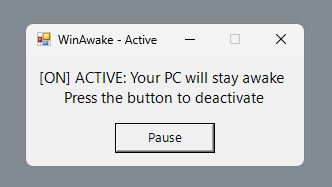

# WinAwake

| WinAwake is a simple Windows utility to keep the system awake.<br>You can run it directly from the command line or download and run the executable file. |  |
|-|-|


## Usage
The script is for Powershell, you can still run it from the Command Prompt by calling the Powershell or even use the executable version.


### Powershell
```ps1
irm "https://cdn.levihub.dev/WinAwake.ps1" | iex
```


### Command Prompt
```bat
powershell -c "irm 'https://cdn.levihub.dev/WinAwake.ps1' | iex"
```


### Download
Use this method if you prefer a more user friendly approach, just download and run the [Latest Release](https://cdn.levihub.dev/WinAwake.exe).

This file was made using the [PS2EXE](https://github.com/MScholtes/PS2EXE) Powershell module for converting Powershell scripts to executable files.